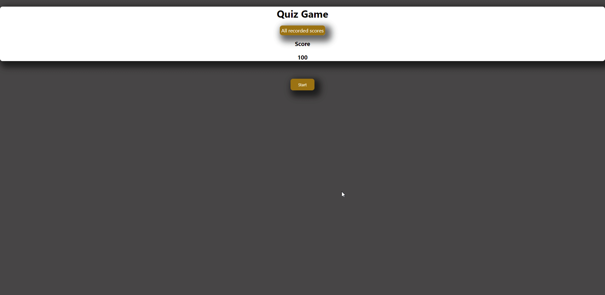

<h1 style="text-align: center;">Password Generator</h1>

[[Deployed-Site]](https://jdogcrane.github.io/PasswordGenerator/)

[[Site-Preview]](#Site-Preview)

## General overview: 

 
For this project the goal was to produce a generated password using javascript on a html page. When the generate password button is pressed the user will receive a series of prompts. The user will choose the criteria for the password and after they are complete the generated password will be displayed in the box for the user to access. 

---
<h3 style="text-align:center;">Instructions</h3>
---

1. Click Generate Password
2. Input a valid length for password
3. Select if you want numbers in the password
4. Select if you want special characters in the password
5. Select if you want uppercase in the password
6. Select if you want lowercase in the password
7. Copy your password and enjoy!

---
<h3 style="text-align:center;">JS-Summary</h3>
---

* Added Password object with password criteria
* Added array with all letters the generator will use
* Added all capital letters the generator will use
* Added all special characters the generator will use
* Added all numbers the generator will use
* Added a generatePassword function to create password with the criteria the user chooses

>Notes: The default length is set to 8 for the password allowing for a click only experience 

## Site Preview
